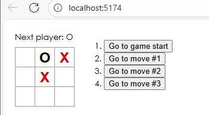
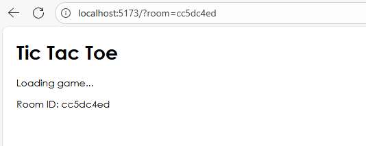

# React Tutorial: Tic-Tac-Toe

Proyecto listo para correr con **Vite y React**, implementando el juego de tres en raya tal, historial de jugadas y cálculo de ganador

## Requisitos
- Node.js 18+
- npm 9+ 

## Ejecutar en local
```bash
npm install
npm run dev
```

En donde veremos el juego



Abre la URL que te muestra la consola  http://localhost:5173


Donde el codigo en primera instancia esta igual el front del juego que en el tutorial a excepcion de la x en color rojo

Se agrega salas al Tic-Tac-Toe del tutorial de React para jugar en tiempo real: una sala va en la URL como ?room=ID y que ambos navegadores comparten para sincronizarse. Para usarlo, primero se debe levantar el servidor de salas ejecutando npm install y node server.js en la carpeta server queda escuchando en http://localhost:3001, y luego el cliente con npm install y npm run dev en la carpeta client por defecto en http://localhost:5173

Para la funcionalidad multijugador, utiliza un servidor backend simple creado con Node.js El funcionamiento se basa en salas, los jugadores se unen a la misma sala a través de un identificador en la URL ?room=ID, y el servidor Node.js se encarga de sincronizar los movimientos entre los dos navegadores para que puedan jugar en vivo.

este proyecto  está estructurado en dos aplicaciones principales: un cliente y un servidor. La aplicación React es el cliente, responsable de renderizar la interfaz de usuario el tablero de juego y capturar los movimientos del jugador. La aplicación Node.js es el servidor, creado para permitir el juego multijugador en tiempo real. Ambas están relacionadas en un modelo cliente-servidor: cuando un jugador realiza un movimiento, el cliente de React envía esta información al servidor de Node.js, que luego transmite el movimiento al cliente del otro jugador en la misma sala de juego, asegurando que las pantallas de ambos jugadores estén sincronizadas.


donde veremos que se esta creando la sala:




